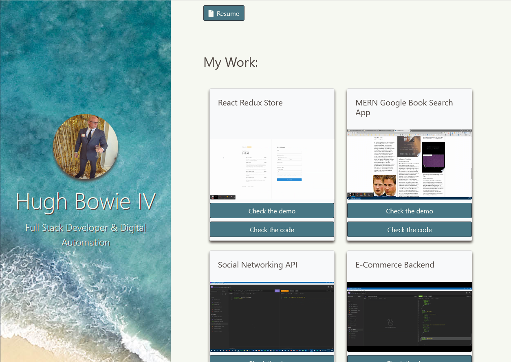

<h1 align="center">CSS Developer Portfolio🚀</h1>

<p align="center">
    
    
    
    

</p>
<p align="center">
    
    
</p>

## 📓 Description

A Portfolio of work using just CSS & HTML

#### [live portfolio](https://hugh-bowie.github.io/portfolio/)

## 🎬 Screenshot



## 🃏 User Story

```
AS AN employer
I WANT to view a potential employee's deployed portfolio of work samples
SO THAT I can review samples of their work and assess whether they're a good candidate for an open position
```

## ✔️ Accpetance Criteria

```
GIVEN I need to sample a potential employee's previous work
WHEN I load their portfolio
THEN I am presented with the developer's name, a recent photo or avatar, and links to sections about them, their work, and how to contact them
WHEN I click one of the links in the navigation
THEN the UI scrolls to the corresponding section
WHEN I click on the link to the section about their work
THEN the UI scrolls to a section with titled images of the developer's applications
WHEN I am presented with the developer's first application
THEN that application's image should be larger in size than the others
WHEN I click on the images of the applications
THEN I am taken to that deployed application
WHEN I resize the page or view the site on various screens and devices
THEN I am presented with a responsive layout that adapts to my viewport
```

## 📋 Table of Contents

-   [Description](#description)
-   [Screenshot](#Screenshot)
-   [User Story](#user-story)
-   [Acceptance Criteria](#acceptance-criteria)
-   [Table of Contents](#table-of-contents)
-   [Installation](#installation)
-   [Usage](#usage)
-   [Contributing](#contributing)
-   [Questions](#questions)

## 🛠 Installation

`git clone https://github.com/hugh-bowie/css-portfolio.git`

## ▶️ Useage

`navigate to https://hugh-bowie.github.io/css-portfolio/`

## 🍻 Contributing

:octocat: [Hugh Bowie](https://github.com/hugh-bowie)

## ⁉️ Questions

Contact me with any questions: [hughbowie@me.com](mailto:hughbowie@me.com)<br />[GitHub](https://github.com/hugh-bowie)<br />
